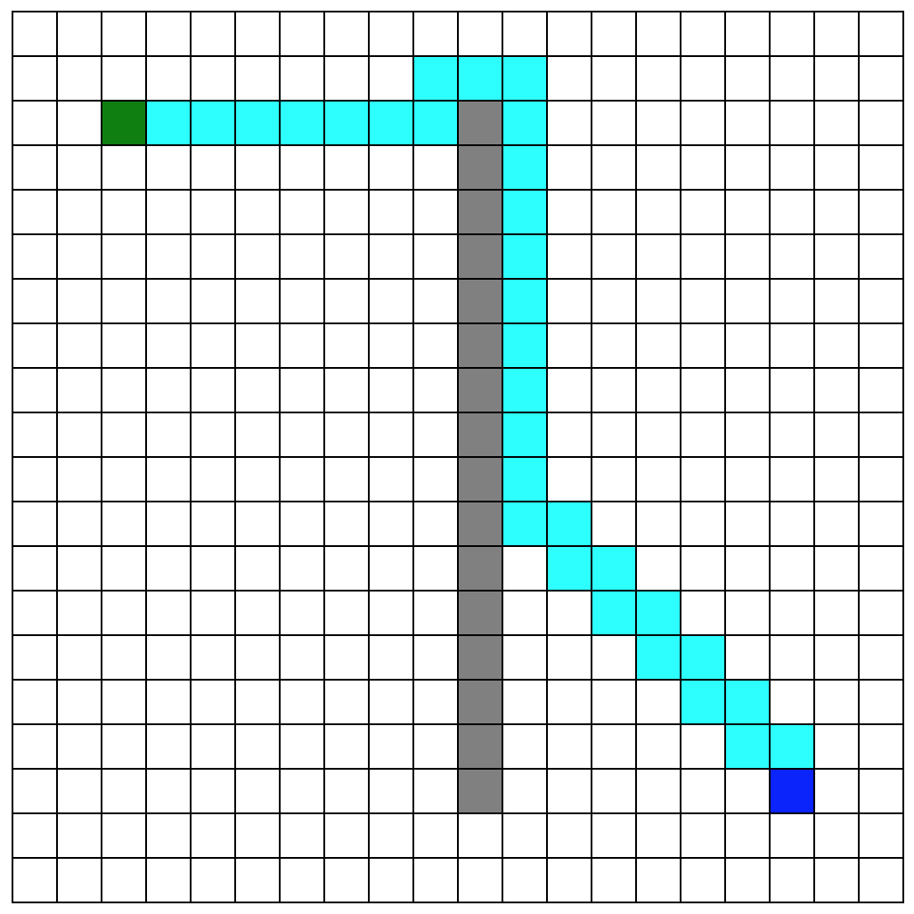

# A* Pathfinding with Elm

Quick experiment porting [`Data.Graph.AStar`](https://hackage.haskell.org/package/astar-0.3.0.0/docs/Data-Graph-AStar.html) to Elm.
Using a local 0.18-upgraded version of [elm-pairing-heap](http://package.elm-lang.org/packages/rhofour/elm-pairing-heap/latest) for the priority queue.

Just for learning; see [krisajenkins/elm-astar](http://package.elm-lang.org/packages/krisajenkins/elm-astar/latest) for a usable Elm package.

## Demo

View the [online demo](http://mattsenior-elm-astar.surge.sh/) or run it yourself with `npm install` then `npm start`.

You’ll see an editable grid with a path that will automatically route around the walls you build.